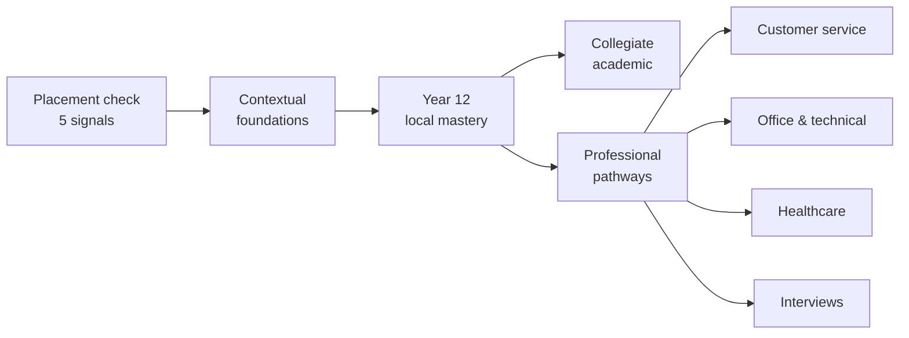

<p align="center">
  
</p>

<h1 align="center">Parcero</h1>

<p align="center">
  <strong>Learn Colombian Spanish the way it is actually spoken — in situations, not word lists.</strong>
</p>

<p align="center">
  <a href="https://tree2juan.github.io/Parcero/"><strong>▶ Open the app</strong></a>
  ·
  <a href="#lessons">Lessons</a>
  ·
  <a href="#add-a-lesson">Add a lesson</a>
  ·
  <a href="#native-speaker-review">Review a lesson</a>
</p>

<p align="center">
  <a href="https://github.com/tree2juan/Parcero/actions/workflows/ci.yml"></a>
  <a href="https://github.com/tree2juan/Parcero/actions/workflows/deploy-pages.yml"></a>
  
  
</p>

---

## What this is

Most language apps teach you words. Parcero teaches you **moments** — the café where `tinto` means black coffee and not red wine, the meeting where `quedó` means "it's done", the interview where `usted` is warmth rather than distance.

Every lesson is one real situation, taught from both directions:

- **English speakers** learning Colombian Spanish
- **Spanish speakers** strengthening practical English

It is a single static page. No build step, no framework, no account, no tracking, no network calls. Your progress lives in your own browser's storage and nowhere else.

## Try it

**→ [tree2juan.github.io/Parcero](https://tree2juan.github.io/Parcero/)**

Or run it locally — any static server will do:

```sh
git clone https://github.com/tree2juan/Parcero.git
cd Parcero
python3 -m http.server 8000
```

Then open `http://localhost:8000`. You can also just open `index.html` directly in a browser.

## How a lesson works

Each lesson has three tabs, in the order a real conversation demands them:

| Tab | What it gives you |
| --- | --- |
| **Dialogue** | A short exchange with the target language, a natural translation, and a plain-English pronunciation respelling. A "Listen" button reads it aloud with your browser's speech engine. |
| **Understand** | The vocabulary *as used in this exchange*, plus a Colombian context note explaining why the phrasing works and where it would mislead you. |
| **Practice** | One retrieval question that checks meaning-in-context rather than translation. |

<a id="lessons"></a>

## The lesson set

Eight lessons spanning starter through extending, mapped onto the roadmap's pathways:

| # | Lesson | Level | Teaches |
| --- | --- | --- | --- |
| 1 | Coffee and a quick chat | Starter · Everyday life | `¿Me regalas...?`, `tinto`, `ya` as "right away" |
| 2 | A ride downtown | Starter · Getting around | Agreeing a fare before the trip; `¿Cuánto me cobra?` |
| 3 | At the market | Starter · Everyday life | `¿A cómo está...?`, `la ñapa`, vendor address terms |
| 4 | What's the plan? | Developing · Social life | `parche`, `de una`, `cuadrar`, and paisa `vos` |
| 5 | A doctor's appointment | Developing · Health | `me duele`, `hace + time`, English present perfect |
| 6 | The team stand-up | Developing · Workplace | `quedó`, `pendiente`, `hacer seguimiento`, hedged status updates |
| 7 | In the seminar | Extending · Academic | `matizar`, `quisiera`, academic hedging in both languages |
| 8 | The job interview | Extending · Professional | `llevo tres años trabajando`, `con mucho gusto`, concrete examples |

Alongside the lessons there is a reference **library**: 200 high-frequency verbs with their most useful forms, a fluency list of connectors and softeners, and an age-gated recognition reference for insulting or adult language — included so learners can *understand* it and de-escalate, never to direct it at anyone.

## Placement and pathways

The app opens with an optional five-signal placement check: receptive understanding, productive use, grammar, context, and pronunciation. Every question includes **"I don't know"**, which records a genuine knowledge gap instead of forcing a guess — a wrong guess and an honest gap mean different things, and the app treats them differently.



Results stay in browser storage and identify a starting level plus the skills to focus on first.

<a id="add-a-lesson"></a>

## Adding a lesson

Lessons live in [`data/lessons.js`](data/lessons.js) as plain objects — no build step, no JSON schema to learn. Add an entry to the `lessons` array and it appears in the picker automatically.

```js
{
  id: "at-the-bank",              // kebab-case, unique
  level: "Developing · Everyday life",
  skills: ["listening", "speaking", "context"],
  domain: "civic life",
  register: "formal polite",
  pathways: ["year-12-local-mastery"],
  review: "pending",              // "pending" until a native speaker signs off
  es: {
    title: "...",
    situation: "...",
    dialogue: [
      // [speaker, target language, natural translation, pronunciation respelling]
      ["Cajero", "¿En qué le puedo colaborar?", "How can I help you?", "en keh leh PWEH-doh koh-lah-boh-RAR"]
    ],
    vocabulary: [["term", "how it is used here"]],
    note: "The Colombian context that makes this phrasing work.",
    prompt: "A meaning-in-context question",
    choices: ["...", "...", "..."],
    answer: 0                     // index into choices
  },
  en: { /* the same shape, with English as the target language */ }
}
```

House rules for content:

- **Both directions, always.** A lesson without its `en` counterpart will fail CI.
- **Never present a regional expression as universal.** Say where it is used and by whom.
- **Teach the pragmatics, not just the words.** `usted` vs `tú` vs `vos` carries more meaning than most vocabulary does.
- **Leave `review: "pending"`.** The app shows an honest banner until a native speaker has checked it.

## Tests

Content is validated by a dependency-free suite. Node 20+ only, nothing to install:

```sh
node --test test/
```

It checks that every lesson teaches in both directions, that dialogue and vocabulary rows match the shape the renderers expect, that each practice question points at a real answer among distinct choices, that verb entries are complete and uniquely identified, and — the one that catches the most damage — that **every element `app.js` looks up actually exists in `index.html`**. CI runs the same command on every pull request.

<a id="native-speaker-review"></a>

## Native-speaker review

Regional usage is the part most easily got wrong, so the app is honest about it: every lesson carries a `review` field, and while it is `"pending"` the learner sees a banner saying so. Nothing unverified is presented as settled.

**Reviewers need no code editor.** Open **[Issues → New issue → Lesson review](https://github.com/tree2juan/Parcero/issues/new?template=lesson-review.yml)**, pick a lesson from the dropdown, and answer a short form covering naturalness, regional framing, register, and pronunciation. A maintainer applies the wording and flips that lesson to `"reviewed"`, which removes the banner.

Aim for two sign-offs per lesson: a native Colombian Spanish speaker for the `es` side, and a native or expert English speaker for the `en` side.

The mature-language reference needs the same care from qualified reviewers — severity labels, local usage, and de-escalation guidance. Content that encourages harassment does not belong here.

## Project structure

```
index.html          The whole app shell — every element id app.js binds to
app.js              Rendering, placement scoring, lesson navigation, progress
styles.css          Design system: light/dark tokens, layout, components
data/lessons.js     The lessons
data/curriculum.js  200 verbs, fluency connectors, mature-language reference
assets/             Favicon, social card, roadmap diagram
test/               Dependency-free content validation
.github/workflows/  CI on every PR, Pages deployment on main
```

## Accessibility and privacy

- Semantic landmarks, a skip link, ARIA tabs, and live regions for the parts that update.
- Visible focus rings, and full keyboard operation of lessons, tabs, and the placement check.
- Respects `prefers-color-scheme` (light and dark) and `prefers-reduced-motion`.
- No analytics, no cookies, no third-party requests. `localStorage` holds your direction, progress, and placement result — "Reset progress" clears all of it.

## Deployment

Pushes to `main` publish the repository root to GitHub Pages via [`.github/workflows/deploy-pages.yml`](.github/workflows/deploy-pages.yml). The Pages source is set to **GitHub Actions** (Settings → Pages → Build and deployment). Until a commit lands on `main`, the site returns 404 — there is nothing to serve.

## Contributing

Lesson contributions, corrections to regional framing, and accessibility fixes are all welcome. Open an issue first for new lessons so we can check the situation is not already covered, run `node --test test/` before opening a pull request, and keep the app dependency-free.
