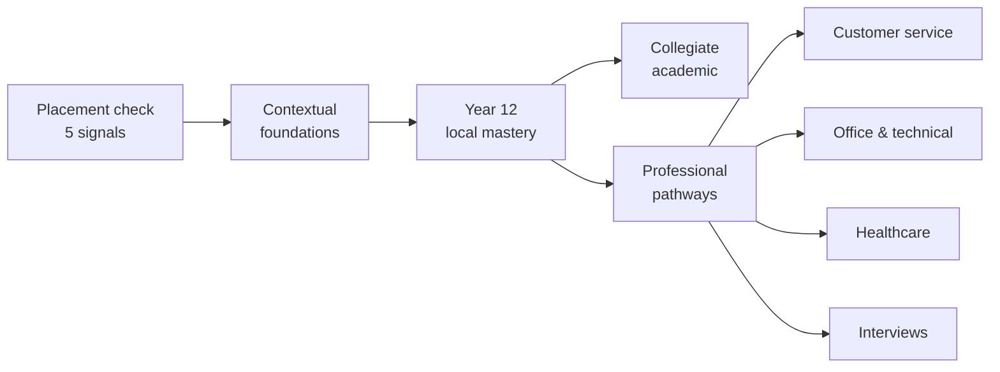

<p align="center">
  
</p>

<h1 align="center">Parcero</h1>

<p align="center">
  <strong>Learn Colombian Spanish the way it is actually spoken — in situations, not word lists.</strong>
</p>

<p align="center">
  <a href="https://tree2juan.github.io/Parcero/"><strong>▶ Open the app</strong></a>
  ·
  <a href="#lessons">Lessons</a>
  ·
  <a href="#add-a-lesson">Add a lesson</a>
  ·
  <a href="#native-speaker-review">Review a lesson</a>
</p>

<p align="center">
  <a href="https://github.com/tree2juan/Parcero/actions/workflows/ci.yml"></a>
  <a href="https://github.com/tree2juan/Parcero/actions/workflows/deploy-pages.yml"></a>
  
  
</p>

---

## What this is

Most language apps teach you words. Parcero teaches you **moments** — the café where `tinto` means black coffee and not red wine, the meeting where `quedó` means "it's done", the interview where `usted` is warmth rather than distance.

Every lesson is one real situation, taught from both directions:

- **English speakers** learning Colombian Spanish
- **Spanish speakers** strengthening practical English

It is a single static page. No build step, no framework, no account, no tracking, no network calls. Your progress lives in your own browser's storage and nowhere else.

## Try it

**→ [tree2juan.github.io/Parcero](https://tree2juan.github.io/Parcero/)**

Or run it locally — any static server will do:

```sh
git clone https://github.com/tree2juan/Parcero.git
cd Parcero
python3 -m http.server 8000
```

Then open `http://localhost:8000`. You can also just open `index.html` directly in a browser.

## How a lesson works

Each lesson has five tabs, in the order a real conversation demands them:

| Tab | What it gives you |
| --- | --- |
| **The situation** | Who is talking, what they want, when and where it happens, and why any of it matters — plus the address form the exchange runs on (`usted`, `tú` or `vos`), who uses it, and what changes if you switch. Spanish decides half its grammar from this, so it comes first. |
| **Dialogue** | A short exchange with the target language, a natural translation, and a plain-English pronunciation respelling. Lines that hide something carry a literal gloss and a note on why it is phrased that way. A "Listen" button reads it aloud with your browser's speech engine. |
| **Understand** | The vocabulary *as used in this exchange* — with a literal reading, when to reach for it, when not to, what region it belongs to, and an example — then what is going on underneath the exchange, what learners get wrong here and what to say instead, and the same thing said differently across registers and regions. |
| **Practice** | Several retrieval questions that check meaning-in-context rather than translation, each naming what it is testing. |
| **Report an error** | Tell a maintainer that something is wrong, without leaving the lesson. See [Native-speaker review](#native-speaker-review). |

<a id="lessons"></a>

## The lesson set

Eight lessons spanning starter through extending, mapped onto the roadmap's pathways:

| # | Lesson | Level | Teaches |
| --- | --- | --- | --- |
| 1 | Coffee and a quick chat | Starter · Everyday life | `¿Me regalas...?`, `tinto`, `ya` as "right away" |
| 2 | A ride downtown | Starter · Getting around | Agreeing a fare before the trip; `¿Cuánto me cobra?` |
| 3 | At the market | Starter · Everyday life | `¿A cómo está...?`, `la ñapa`, vendor address terms |
| 4 | What's the plan? | Developing · Social life | `parche`, `de una`, `cuadrar`, and paisa `vos` |
| 5 | A doctor's appointment | Developing · Health | `me duele`, `hace + time`, English present perfect |
| 6 | The team stand-up | Developing · Workplace | `quedó`, `pendiente`, `hacer seguimiento`, hedged status updates |
| 7 | In the seminar | Extending · Academic | `matizar`, `quisiera`, academic hedging in both languages |
| 8 | The job interview | Extending · Professional | `llevo tres años trabajando`, `con mucho gusto`, concrete examples |

Alongside the lessons there is a reference **library**: 200 high-frequency verbs with their most useful forms, a fluency list of connectors and softeners, and an age-gated recognition reference for insulting or adult language — included so learners can *understand* it and de-escalate, never to direct it at anyone.

## Placement and pathways

The app opens with an optional five-signal placement check: receptive understanding, productive use, grammar, context, and pronunciation. Every question includes **"I don't know"**, which records a genuine knowledge gap instead of forcing a guess — a wrong guess and an honest gap mean different things, and the app treats them differently.



Results stay in browser storage and identify a starting level plus the skills to focus on first.

<a id="add-a-lesson"></a>

## Adding a lesson

Lessons live in [`data/lessons.js`](data/lessons.js) as plain objects — no build step, no JSON schema to learn. Add an entry to the `lessons` array and it appears in the picker automatically.

Every field below except `title`, `situation`, `dialogue`, `vocabulary`, `note`, `prompt`, `choices` and `answer` is optional: [`data/lesson-schema.js`](data/lesson-schema.js) fills in the rest, so a partly written lesson still renders. Rows may be written as objects (preferred) or as the original short tuples.

```js
{
  id: "at-the-bank",              // kebab-case, unique
  level: "Developing · Everyday life",
  skills: ["listening", "speaking", "context"],
  domain: "civic life",
  register: "formal polite",
  pathways: ["year-12-local-mastery"],
  review: "pending",              // "pending" until a native speaker signs off
  es: {
    title: "...",
    situation: "...",

    // The five questions a learner has to answer before the words mean anything.
    setting: {
      who: "A teller in her forties and a foreign customer.",
      what: "Opening a savings account without a Colombian ID.",
      when: "Mid-morning on a weekday, the branch is busy.",
      where: "A bank branch in Bogotá.",
      why: "Bank staff are scripted and formal; warmth arrives through diminutives, not first names."
    },

    // Which "you" the exchange runs on, and what moving off it would signal.
    address: {
      form: "usted",              // "usted" | "tú" | "vos" | "mixed"
      who: "The teller to the customer, and back.",
      why: "Service encounters in Bogotá default to usted regardless of age.",
      ifYouSwitch: "Tú here sounds over-familiar and slightly presumptuous."
    },

    dialogue: [
      {
        speaker: "Cajero",
        target: "¿En qué le puedo colaborar?",
        translation: "How can I help you?",
        pronunciation: "en keh leh PWEH-doh koh-lah-boh-RAR",
        literal: "In what can I collaborate for you?",   // optional
        why: "Colombians say colaborar where other Spanishes say ayudar; it is warmer and less transactional."
      }
    ],

    vocabulary: [
      {
        term: "colaborar",
        explanation: "To help — the standard Colombian service verb.",
        literal: "to collaborate",
        useWhen: "Offering or asking for help in any shop, bank or office.",
        avoidWhen: "Talking about joint work on a project; there it means literal collaboration.",
        register: "polite",
        region: "General Colombian",
        related: ["ayudar", "servir"],
        example: { target: "¿Me colabora con la dirección?", translation: "Could you help me with the address?" }
      }
    ],

    note: "The Colombian context that makes this phrasing work.",

    culture: [{ label: "Why it is so formal", body: "..." }],
    pitfalls: [{ mistake: "...", whyItFails: "...", sayInstead: "..." }],
    variations: [{ form: "...", register: "casual", region: "Medellín", whenToUse: "..." }],

    prompt: "A meaning-in-context question",
    choices: ["...", "...", "..."],
    answer: 1,                    // index into choices
    tests: "Whether you heard colaborar as an offer of help",  // optional

    // Any number of further questions, same shape as prompt/choices/answer.
    practiceExtra: [{ prompt: "...", choices: ["...", "...", "..."], answer: 2, tests: "..." }]
  },
  en: { /* the same shape, with English as the target language */ }
}
```

House rules for content:

- **Both directions, always.** A lesson without its `en` counterpart will fail CI.
- **Answer the five questions.** `setting` is where a learner works out who is speaking and why it is phrased this way. CI fails if any of the five is missing.
- **Name the address form.** `usted` vs `tú` vs `vos` carries more meaning than most vocabulary does, so say which one is in play and what switching would signal.
- **Never present a regional expression as universal.** Every vocabulary entry states its `region`. `vos` is paisa and Valle, not Colombian at large.
- **Say what goes wrong.** A pitfall without `sayInstead` leaves the learner stuck, so all three fields are required.
- **Do not make the right answer guessable.** `choices` and `answer` are a pair — `answer` is an index, so moving one means moving the other. CI fails if answers cluster at one position, if the correct choice is reliably the longest, if it towers over its distractors, or if a distractor is too short to be worth considering. See [`test/practice.test.js`](test/practice.test.js).
- **Leave `review: "pending"`.** The lesson keeps inviting a native speaker to check it until one has.

## Tests

Content is validated by a dependency-free suite. Node 20+ only, nothing to install:

```sh
node --test test/*.test.js
```

It checks that every lesson teaches in both directions, that every lesson answers who/what/when/where/why and names its address form, that dialogue and vocabulary rows match the shape the renderers expect, that pitfalls always say what to say instead, that each practice question points at a real answer among distinct choices — and that the right answer is not guessable from its position or its length — that verb entries are complete and uniquely identified, that every review anchor resolves to a real string, that the report picker can reach every kind of content a lesson now holds, and — the one that catches the most damage — that **every element `app.js` and `review-ui.js` look up actually exists in `index.html`**. CI runs the same command on every pull request.

`test/globals.test.js` covers a failure the rest of the suite structurally cannot see. The page loads every script into one global scope, so a name a script does not define does not fail — it silently resolves to whatever another script put there. A handler calling `render()` from a file that has no `render` reaches `app.js`'s, and the result is a control that does nothing while an unrelated section redraws, with no error on any content. Under `node --test`, `require()` gives every module its own scope, so those two names can never meet; the bug is not merely untested there, it is untestable there. The guard reads the scripts as text in the order `index.html` loads them.

Cross-script API is therefore marked by name, with the `Parcero*` prefix, and data bundles publish their globals by living in `data/`. That is a rule rather than a preference because no runtime check can replace it: `const` at the top level of a classic script creates a binding in the global *scope* and no property on the global *object*, so `globalThis.curriculum` is `undefined` while bare `curriculum` is the array, and `globalThis.lessons` is not the data but the `<section id="lessons">`, via named access on `window`. Reflection cannot see a `const` global at all, and cannot tell published API from a function declaration.

> Pass the glob, not the bare directory. Node 22 and newer resolve `node --test test/` as a *module* path and fail with `Cannot find module`; `test/*.test.js` works on every version.

<a id="native-speaker-review"></a>

## Native-speaker review

Regional usage is the part most easily got wrong, so the app is honest about it: every lesson carries a `review` field, and while it is `"pending"` the lesson invites a native speaker to check it. Nothing unverified is presented as settled.

Review happens at two grains, and both need a reviewer who knows the language, not the codebase.

### Report an error from the page

The fastest correction is the one made while looking at the mistake. Every lesson has a **Report an error** tab, next to Dialogue, Understand and Practice. Nothing is added to the lesson itself: no controls hang off individual lines, so a learner reading a lesson never has to see review furniture.

The tab asks two questions to find the string: **what are you reporting on** — the lesson you are reading, a verb, a fluency phrase, or a mature-language entry — and **which one**, listed by its own words rather than by position. Everything a lesson holds is reachable: each line of the situation, the address-form note, every dialogue line, vocabulary entry, context note, pitfall, variation and practice question. It then narrows to the exact part: the Spanish line, the translation, the pronunciation respelling, the speaker's name, and so on. The text you picked is quoted back to you before you say anything about it.

From there it asks what is wrong (not natural, wrong region, wrong register, mistranslation, misleading pronunciation, spelling, culture, risky, dated), how much it matters, and — the field that does the real work — **how you would say it instead**. Reports collect in your browser, so you can read a whole lesson and report as you go, and any saved report can be reopened and edited. A half-written report keeps hold of the line it is about: paging to the next lesson or switching language will not quietly re-point it at something else. **Open a GitHub issue with these** then opens a prefilled issue containing both a readable report and a machine-readable payload. Copy-to-clipboard and download-JSON are offered as fallbacks, including when a batch is too large for a URL.

Nothing is sent anywhere until you press submit. Reports live only in your browser, under their own storage key, so *Reset progress* never destroys them.

Because regional usage is the thing this project most needs help with, the form also asks where you speak from. Ten Colombian regions are offered as suggestions, but the field is open — type wherever you are from and it is recorded in your own words. Where what you typed matches a suggestion, the report also carries a stable region code, so that a year of reports can be counted by region without anyone having to guess that "Medellin" and "Medellín and Antioquia (paisa)" meant the same place. `node scripts/review-flags.js` prints that tally. Reports filed through the issue form instead of the page arrive without a code, because that form is plain text with no JavaScript behind it, so the tool canonicalises those itself — in either interface language, so a region written in Spanish is counted alongside the same region written in English. Anything it does not recognise keeps the reviewer's own words and is counted under them rather than discarded.

### Sign off a whole lesson

For a considered pass over a complete lesson, open **[Issues → New issue → Lesson review](https://github.com/tree2juan/Parcero/issues/new?template=lesson-review.yml)**, pick a lesson, and answer a short form covering naturalness, regional framing, register, and pronunciation. A maintainer applies the wording and flips that lesson to `"reviewed"`.

Aim for two sign-offs per lesson: a native Colombian Spanish speaker for the `es` side, and a native or expert English speaker for the `en` side.

### Triaging flags as a maintainer

Every flag stores an **anchor** — a stable address such as `lesson:greeting-at-the-cafe/es/dialogue/1/target` — plus the exact text the reviewer was looking at. Resolve a filed issue back to the lines to edit:

```sh
node scripts/review-flags.js flags.json          # a downloaded payload
gh issue view 42 --json body -q .body | node scripts/review-flags.js -
node scripts/review-flags.js flags.json --format markdown   # to paste back into the issue
```

For each flag it prints the file, the field, the current wording, and the suggestion, then sorts them:

- **Ready** — the text still matches what the reviewer saw. Apply the suggestion.
- **Drifted** — the text changed after it was flagged. The tool refuses to call these ready, because applying one blind would silently revert a newer edit. Re-read it and decide.
- **Unresolved** — the anchor no longer points at anything, usually because content was deleted or renamed. Exits non-zero.

You do not have to run it yourself. When a flag is filed from the page, the **Triage native-speaker flags** workflow runs this same tool against the content as it stands right now and posts the result on the issue, labelling it `triage-ready`, `triage-needs-human`, or `triage-manual`. Editing the issue re-runs it and updates the same comment rather than adding another. A flag filed by hand, without the machine-readable block, is labelled `triage-manual` and left for a person — it is still a valid flag, it simply cannot be resolved automatically. The workflow reads the issue body through the environment rather than interpolating it into a shell command, and asks for no write access beyond the issue it is commenting on.

Once a lesson's flags are applied and both sides are signed off, set its `review` field to `"reviewed"`.

The mature-language reference needs the same care from qualified reviewers — severity labels, local usage, and de-escalation guidance. Content that encourages harassment does not belong here.

## Project structure

```
index.html          The whole app shell — every element id app.js binds to
app.js              Rendering, placement scoring, lesson navigation, progress
review.js           Review anchors: parse, resolve, validate, build issue payloads
review-ui.js        The Report an error tab: content picker, report form, queue, issue export
styles.css          Design system: light/dark tokens, layout, components
data/lessons.js     The lessons
data/lesson-schema.js  The lesson shape: defaults, normalisation, legacy tuples
data/curriculum.js  200 verbs, fluency connectors, mature-language reference
scripts/            Maintainer tools: triage flags back to the lines to edit
.github/workflows/  CI, Pages deploy, and automatic triage of filed flags
assets/             Favicon, social card, roadmap diagram
test/               Dependency-free content validation
.github/workflows/  CI on every PR, Pages deployment on main
```

## Accessibility and privacy

- Semantic landmarks, a skip link, ARIA tabs, and live regions for the parts that update.
- Visible focus rings, and full keyboard operation of lessons, tabs, and the placement check.
- Respects `prefers-color-scheme` (light and dark) and `prefers-reduced-motion`.
- No analytics, no cookies, no third-party requests. `localStorage` holds your direction, progress, and placement result — "Reset progress" clears all of it.

## Deployment

Pushes to `main` publish the repository root to GitHub Pages via [`.github/workflows/deploy-pages.yml`](.github/workflows/deploy-pages.yml). The Pages source is set to **GitHub Actions** (Settings → Pages → Build and deployment). Until a commit lands on `main`, the site returns 404 — there is nothing to serve.

## Contributing

Lesson contributions, corrections to regional framing, and accessibility fixes are all welcome. Open an issue first for new lessons so we can check the situation is not already covered, run `node --test test/*.test.js` before opening a pull request, and keep the app dependency-free.
