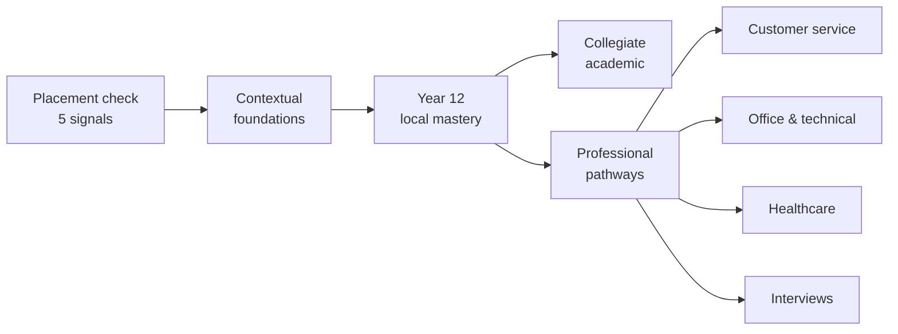

<p align="center">
  
</p>

<h1 align="center">Parcero</h1>

<p align="center">
  <strong>Learn Colombian Spanish the way it is actually spoken — in situations, not word lists.</strong>
</p>

<p align="center">
  <a href="https://tree2juan.github.io/Parcero/"><strong>▶ Open the app</strong></a>
  ·
  <a href="#lessons">Lessons</a>
  ·
  <a href="#add-a-lesson">Add a lesson</a>
  ·
  <a href="#native-speaker-review">Report an error</a>
</p>

<p align="center">
  <a href="https://github.com/tree2juan/Parcero/actions/workflows/ci.yml"></a>
  <a href="https://github.com/tree2juan/Parcero/actions/workflows/deploy-pages.yml"></a>
  
  
</p>

---

## What this is

Most language apps teach you words. Parcero teaches you **moments** — the café where `tinto` means black coffee and not red wine, the meeting where `quedó` means "it's done", the interview where `usted` is warmth rather than distance.

Every lesson is one real situation, taught from both directions:

- **English speakers** learning Colombian Spanish
- **Spanish speakers** strengthening practical English

It is a single static page. No build step, no framework, no account, no tracking, no network calls. Your progress lives in your own browser's storage and nowhere else.

## Try it

**→ [tree2juan.github.io/Parcero](https://tree2juan.github.io/Parcero/)**

Or run it locally — any static server will do:

```sh
git clone https://github.com/tree2juan/Parcero.git
cd Parcero
python3 -m http.server 8000
```

Then open `http://localhost:8000`. You can also just open `index.html` directly in a browser.

## How a lesson works

Each lesson has five tabs, in the order a real conversation demands them:

| Tab | What it gives you |
| --- | --- |
| **The situation** | Who is talking, what they want, when and where it happens, and why any of it matters — plus the address form the exchange runs on (`usted`, `tú` or `vos`), who uses it, and what changes if you switch. Spanish decides half its grammar from this, so it comes first. |
| **Dialogue** | A short exchange with the target language, a natural translation, and a plain-English pronunciation respelling. Lines that hide something carry a literal gloss and a note on why it is phrased that way. A "Listen" button reads it aloud with your browser's speech engine. |
| **Understand** | The vocabulary *as used in this exchange* — with a literal reading, when to reach for it, when not to, what region it belongs to, and an example — then what is going on underneath the exchange, what learners get wrong here and what to say instead, and the same thing said differently across registers and regions. |
| **Practice** | Several retrieval questions that check meaning-in-context rather than translation, each naming what it is testing. |
| **Report an error** | Tell a maintainer that something is wrong, without leaving the lesson. See [Reporting an error](#native-speaker-review). |

### Three-minute study segments

A full lesson is roughly fifteen minutes of reading per direction, which is more than most people sit down to do at once. [`data/lesson-schema.js`](data/lesson-schema.js) therefore derives **study segments** of about three minutes each, at 130 words per minute, from the content itself.

Segments are computed and never authored. A `segments` key checked into a lesson would go stale the first time anyone edited a line of dialogue, and it would go stale silently — so a test rejects one outright.

They are packed to be **even rather than full**. Filling each segment to a word budget in turn leaves whatever is left over as the last segment, which in practice meant tails of thirty words: technically a segment, useless as a sitting. Instead the deriver works out how many segments the content wants, divides evenly, and packs against that target — the same reasoning that splits flashcard sets 7 + 6 rather than 10 + 3. Every segment currently lands between 240 and 520 words, and a test holds that band.

<a id="lessons"></a>

## The lesson set

**245 lessons** spanning starter through extending, of three kinds. Two hundred are anchored one-to-one to the verb curriculum — every verb in `data/curriculum.js` has exactly one lesson that teaches it, and no verb has two. Thirty-seven are anchored the same way to the **grammar curriculum** in `data/structures.js`. The remaining eight are the original hand-written situation lessons, which predate the one-thing-per-lesson rule and are kept because they teach situations rather than a single form:

| # | Lesson | Level | Teaches |
| --- | --- | --- | --- |
| 1 | Coffee and a quick chat | Starter · Everyday life | `¿Me regalas...?`, `tinto`, `ya` as "right away" |
| 2 | A ride downtown | Starter · Getting around | Agreeing a fare before the trip; `¿Cuánto me cobra?` |
| 3 | At the market | Starter · Everyday life | `¿A cómo está...?`, `la ñapa`, vendor address terms |
| 4 | What's the plan? | Developing · Social life | `parche`, `de una`, `cuadrar`, and paisa `vos` |
| 5 | A doctor's appointment | Developing · Health | `me duele`, `hace + time`, English present perfect |
| 6 | The team stand-up | Developing · Workplace | `quedó`, `pendiente`, `hacer seguimiento`, hedged status updates |
| 7 | In the seminar | Extending · Academic | `matizar`, `quisiera`, academic hedging in both languages |
| 8 | The job interview | Extending · Professional | `llevo tres años trabajando`, `con mucho gusto`, concrete examples |

The verb lessons follow the curriculum's own tiers — 70 foundation, 80 independent, 50 extension — and live in `data/lessons/NN-*.js`, roughly three lessons to a file. `node scripts/verb-coverage.js` prints what is taught and what is left; it is the quickest way to see the shape of the course.

### The grammar curriculum

A verb-per-lesson course teaches vocabulary well and grammar only by accident. `data/structures.js` is the closed list that fixes that: 37 grammar points, each taught by exactly one lesson, each carrying a `probe` regex that a test runs against the lesson's own Spanish dialogue. A grammar lesson whose dialogue never uses its grammar fails the build, so the teaching and the example cannot drift apart.

The list was assembled in two passes, and the difference between them is the interesting part.

The first 25 were chosen for **absence** — forms the corpus barely contained, found by running probes over every utterance the course ships. Comparatives appeared 7 times and `tan ... como` not at all, so those became lessons.

The last 12 were chosen for the opposite reason: forms that are **everywhere and explained nowhere**. Measuring 6,478 Spanish utterances turned up `por` and `para` 312 times, 811 preverbal object pronouns, 395 imperfects, 90 adverbial subjunctive triggers — with no lesson anywhere stating the rule behind any of them. A learner met these on nearly every page and was never told how they work, which is precisely the profile of the errors that fossilize in self-study. That pass added `ser` vs `estar`, gender and agreement, articles and quantity, object pronouns, preterite vs imperfect, commands and requests, `por` vs `para`, real conditionals, relative clauses, the volitional and adverbial subjunctive, and discourse connectors — the last being the thinnest slot ever measured here, at 6 connectors in 6,478 utterances, against B2 rubrics that assess cohesion directly.

Structures carry their own tier (`foundation`, `independent`, `extension`) independently of the band of the module they sit in, so a foundation-tier grammar point can appear in an A2 module where it is actually needed.

Alongside the lessons there is a reference **library**: 200 high-frequency verbs with their most useful forms, a fluency list of connectors and softeners, and a **Colombian slang** reference.

The slang reference carries a field the others do not: **how safe each phrase is for a learner to actually say**. Meaning alone is not enough, because the gap between understanding `parcero` and understanding `gonorrea` is not a gap in translation — it is a gap in what happens to you if you use it. Every entry is marked *Say it freely*, *Say it with friends*, or *Understand only*, and the label is shown before the meaning rather than after it.

**After Dark** is its own area, in its own midnight theme: 150 entries of strong Colombian language, 50 each for Bogotá, Medellín and Barranquilla. Most Colombian profanity is national, but its *force* is not — the same word can be affectionate filler among paisa friends and a fighting word between strangers in Bogotá. That is why shared terms repeat per city with the reading that city gives them; the overlap is the point. Each entry carries a severity that rates the risk of *repeating* the phrase rather than how rude it sounds. It is there so learners can **understand** what they hear and judge a room — never to direct it at anyone.

The verb list was seeded from published frequency data, so the **level** on each card is real. **Register** is published as a general guide; the Report an error tab is where corrections start, and it accepts a report against that field on any verb.

Each verb also carries a `regionality` field, but it is not rendered: it holds the identical string on all 200 verbs, so as a per-verb tag it looked like verb-specific data while telling a learner nothing. The field is kept in the data, and `app.js` and `VERB_SLOTS` in `review.js` are where it would come back if it ever earns per-verb values.

The withholding mechanism stays in place: adding `reviewStatus` back to a verb hides its register again until the flag is dropped, so a batch of unchecked content can still be held back deliberately.

<a id="flashcards"></a>

## Flashcards

Short swipeable sets for the retrieval practice that makes any of it stick. Tap a card to show the answer, then:

- **Swipe left** — green, *knew it*. The card is done for this round.
- **Swipe right** — red, *didn't know it*. The card goes to the back of the queue and comes back around before the set ends.

A set is finished only when every card has been swiped left, so you never leave a set with something still unlearned. **Go through it again** replays the set from scratch, **Reset this set** clears it mid-round, and the global *Reset progress* clears every deck.

Everything works without a touchscreen: the card is a real button, space flips it, and ← / → answer it. Vertical scrolling is preserved on phones (`touch-action: pan-y`), so a swipe down scrolls the page rather than grading the card. Large **← Knew it** and **Didn't know it →** buttons sit under the card for anyone who would rather not drag.

Answers drawn from prose rather than a single term — a culture note, why a mistake fails — are clamped to a few lines with a **Read the rest** control, so one long card cannot stretch past a phone screen. Whether a card needs it is measured after the card is painted rather than guessed from a character count, because the same sentence wraps to four lines on a laptop and nine on a phone. The control sits outside the card deliberately: the card carries `role="button"`, and ARIA treats the descendants of a button as presentational, so a control nested inside it would be invisible to a screen reader.

### Cards are derived, never authored

There is no flashcard content file. `data/flashcards.js` reads the same `lessons`, `curriculum`, `fluencyItems`, `slangItems` and mature reference that the rest of the app renders, and builds decks from them:

| Group | Topic | Cards from |
| --- | --- | --- |
| **Situations** | one per lesson | vocabulary, meaning-in-context, pronunciation, worked examples, region and register, culture notes, common mistakes, phrasing variations, the form of address, the practice questions |
| **Verbs** | one per level (foundation, independent, extension) | each verb, asked in the productive direction |
| **Fluency** | one | connectors and softeners, asked in the productive direction |
| **Slang** | one per safety level (say it freely, say it with friends, understand only) | each slang phrase, its meaning, where it is said, and whether you may use it |
| **Recognition and safety** | two, and only when the age gate is open | insults and adult language, and the warning signals that a conversation is turning |

So adding a lesson to `data/lessons/` adds a flashcard topic. Adding verbs adds cards to the matching level. Nothing has to be written twice, and no card can drift out of sync with the lesson it came from. The decks follow the language direction toggle, and switching direction keeps your place in the set.

Two rules keep the gated decks honest. Gated cards are **absent from the deck, not hidden in it**, so nothing to be unlocked is ever present in the page for a closed gate. And the gate opens only on the boolean `true` — the flag comes from `localStorage`, which returns strings, and the string `"false"` is truthy, so anything less strict would have unlocked on the value that means the opposite.

Slang cards are drilled in the recognition direction only. The safety note rides on the front of every card rather than the back, because a learner meeting `"Understand only"` for the first time needs it before they answer, not after.

### Reading richer lessons without a second code path

Lesson rows are moving from positional tuples (`[speaker, line, translation]`) to named objects carrying much more per entry. `data/flashcards.js` reads every row through one shape-tolerant accessor, so both shapes produce identical cards for the fields they share, and the richer fields simply add more.

This matters more than it sounds. Destructuring an object throws outright, so reading a row positionally does not degrade as the data grows — it takes the whole section down. A test asserts that a lesson written both ways yields the same cards, rather than merely that nothing crashed, and a second test pins each rich field to the card it feeds, so a renamed field is a failure rather than a card that quietly stops being generated.

The card kinds a lesson can yield:

| Kind | Front | Back |
| --- | --- | --- |
| `vocabulary` / `meaning` | a term, or its explanation | the other one |
| `pronunciation` | a line of dialogue | how to say it |
| `example` | the phrase in use | what it means |
| `region` | a term | where it is said, and how formal |
| `context` | the situation | the culture note |
| `address` | who you are speaking to | *usted*, *tú* or *vos*, and why |
| `culture` | a cultural point | what to know about it |
| `pitfall` | a mistake learners make | what to say instead |
| `variation` | when you would use it | the phrasing that fits |
| `practice` | a practice question | its answer |

A kind that current content happens not to produce is still checked for wording, because the checked list is read out of the derivation itself rather than from the cards it currently emits.

The surrounding interface follows the direction too. `data/flashcards.js` emits i18n keys rather than sentences — `deck.ask.pronunciation`, not `"How would you say this out loud?"` — and `flashcards.js` resolves them through `i18n.js` at paint time, so the prompts, controls and screen-reader announcements are in the learner's own language. A test derives the key list from the real content, so a new verb level that nobody has translated yet is caught rather than shipped.

Sets are split evenly rather than greedily, so a topic never ends in a stub round — 13 cards become 7 + 6, not 10 + 3. `FLASHCARD_SET_SIZE` in `data/flashcards.js` is the single knob for the target size. Deck size scales with the lessons without a line of flashcard code changing: the 245 lessons currently yield **26,802 cards across 2,964 sets** in the two directions combined, rising to 27,117 when the age gate is opened. Every lesson produces a deck in both directions — a test asserts it, so a lesson that somehow built no cards would fail rather than quietly go unstudied.
## Placement and pathways

The app opens with an optional five-signal placement check: receptive understanding, productive use, grammar, context, and pronunciation. Every question includes **"I don't know"**, which records a genuine knowledge gap instead of forcing a guess — a wrong guess and an honest gap mean different things, and the app treats them differently.



Results stay in browser storage and identify a starting level plus the skills to focus on first.

<a id="add-a-lesson"></a>

## Adding a lesson

Lessons live in [`data/lessons.js`](data/lessons.js) and in themed block files under [`data/lessons/`](data/lessons) as plain objects — no build step, no JSON schema to learn. Add an entry and it appears in the picker automatically.

`data/lessons.js` declares the `lessons` array; each block file calls `lessons.push(...)` on it. A block is one theme, a handful of lessons, and a file small enough to review in a diff — which a single six-megabyte catalogue is not. Two things must be true of a new block, and both are tested: it needs a `<script>` tag in `index.html` **after** `data/lessons.js`, and the file it names must exist. Without the first, the tests would still find the block by globbing the directory while every actual reader got a page missing those lessons.

While writing one, check it on its own rather than running the whole suite over a catalogue that may not yet parse:

```bash
node scripts/check-lesson-block.js data/lessons/02-foundation-state.js
```

Each lesson names the one curriculum verb it is built on, in its `verb` field. It must be a verb that exists in `data/curriculum.js`, no other lesson may claim it, and it has to actually be spoken in the dialogue — coverage used to be inferred by searching prose for verb forms, which credited a verb for turning up in a translation and missed any taught only as a conjugation.

The file must also end by stamping itself, so the review tooling can send a native speaker to the right file:

```js
markSource(lessons, "data/lessons/02-foundation-state.js");
```

A lesson's index in the `lessons` array says nothing about where its text is written, so without the stamp every flag raised against a block lesson points at `data/lessons.js` at an index that file does not have. `markSource` is defined in `data/lessons.js` and claims only lessons nobody has claimed yet.

To see what is left to write, and which verbs the next block should cover:

```bash
node scripts/verb-coverage.js          # summary, plus the next block
node scripts/verb-coverage.js --list   # every verb still unclaimed
```

The grouping is derived, never stored — a stored plan goes stale as soon as someone writes a lesson out of order, and a stale plan is worse than none because it hands two authors the same verb.

### Which language each field is written in

This is the rule most easily got wrong, and getting it wrong leaves every other check passing: the shape is right, the mirroring is exact, and the lesson is simply unreadable by the person it is for. The reader does not yet speak what is being taught, so **explanation is always in the language the reader already has**.

| | `es` direction | `en` direction |
|---|---|---|
| Reader | English speaker learning Colombian Spanish | Colombian learning English |
| Taught material — `dialogue[].target`, `variations[].form`, `vocabulary[].example.target` | Spanish | English |
| All explanation — `note`, `setting.*`, `address.*`, `dialogue[].translation`/`.why`, `vocabulary[]` prose, `culture[]`, `pitfalls[].whyItFails`, `variations[].whenToUse`, practice prompts | English | Spanish |
| `title` and `situation` | **Spanish** | **Spanish** |

`title` and `situation` are the exception: they are Spanish in *both* directions, because they name the lesson in the picker and that does not change with direction. The `es` direction addresses the reader as tú, the `en` direction as usted.

`pronunciation` is a respelling and belongs to neither language — English-readable for Spanish in the `es` direction, Spanish-readable for English in the `en` direction. Practice `choices` may hold either, since a question can legitimately ask which of three utterances sounds natural.

`node scripts/check-lesson-block.js` enforces the table above. It refuses to judge anything under eight words and strips quoted runs first, because Spanish explanation quotes the English it is teaching; it reports nothing on the eight hand-written lessons.

Every field below except `title`, `situation`, `dialogue`, `vocabulary`, `note`, `prompt`, `choices` and `answer` is optional: [`data/lesson-schema.js`](data/lesson-schema.js) fills in the rest, so a partly written lesson still renders. Rows may be written as objects (preferred) or as the original short tuples.

```js
{
  id: "at-the-bank",              // kebab-case, unique
  level: "Developing · Everyday life",
  skills: ["listening", "speaking", "context"],
  domain: "civic life",
  register: "formal polite",
  pathways: ["year-12-local-mastery"],
  review: "pending",              // legacy field; not shown to readers
  es: {
    title: "...",
    situation: "...",

    // The five questions a learner has to answer before the words mean anything.
    setting: {
      who: "A teller in her forties and a foreign customer.",
      what: "Opening a savings account without a Colombian ID.",
      when: "Mid-morning on a weekday, the branch is busy.",
      where: "A bank branch in Bogotá.",
      why: "Bank staff are scripted and formal; warmth arrives through diminutives, not first names."
    },

    // Which "you" the exchange runs on, and what moving off it would signal.
    address: {
      form: "usted",              // "usted" | "tú" | "vos" | "mixed"
      who: "The teller to the customer, and back.",
      why: "Service encounters in Bogotá default to usted regardless of age.",
      ifYouSwitch: "Tú here sounds over-familiar and slightly presumptuous."
    },

    dialogue: [
      {
        speaker: "Cajero",
        target: "¿En qué le puedo colaborar?",
        translation: "How can I help you?",
        pronunciation: "en keh leh PWEH-doh koh-lah-boh-RAR",
        literal: "In what can I collaborate for you?",   // optional
        why: "Colombians say colaborar where other Spanishes say ayudar; it is warmer and less transactional."
      }
    ],

    vocabulary: [
      {
        term: "colaborar",
        explanation: "To help — the standard Colombian service verb.",
        literal: "to collaborate",
        useWhen: "Offering or asking for help in any shop, bank or office.",
        avoidWhen: "Talking about joint work on a project; there it means literal collaboration.",
        register: "polite",
        region: "General Colombian",
        related: ["ayudar", "servir"],
        example: { target: "¿Me colabora con la dirección?", translation: "Could you help me with the address?" }
      }
    ],

    note: "The Colombian context that makes this phrasing work.",

    culture: [{ label: "Why it is so formal", body: "..." }],
    pitfalls: [{ mistake: "...", whyItFails: "...", sayInstead: "..." }],
    variations: [{ form: "...", register: "casual", region: "Medellín", whenToUse: "..." }],

    prompt: "A meaning-in-context question",
    choices: ["...", "...", "..."],
    answer: 1,                    // index into choices
    tests: "Whether you heard colaborar as an offer of help",  // optional

    // Any number of further questions, same shape as prompt/choices/answer.
    practiceExtra: [{ prompt: "...", choices: ["...", "...", "..."], answer: 2, tests: "..." }]
  },
  en: { /* the same shape, with English as the target language */ }
}
```

House rules for content:

- **Both directions, always.** A lesson without its `en` counterpart will fail CI. The two must also *mirror*: the same number of dialogue turns, vocabulary entries, culture notes, pitfalls, variations and practice questions, and the same optional fields filled on the same rows. Structural parity had been near-perfect and entirely unenforced — each direction was only ever checked against a minimum, so the `related` lists had already drifted in five of the eight original lessons before anything noticed. `address.form` is deliberately exempt: English has one second-person form, so its value is always `"mixed"`.
- **Answer the five questions.** `setting` is where a learner works out who is speaking and why it is phrased this way. CI fails if any of the five is missing.
- **Name the address form.** `usted` vs `tú` vs `vos` carries more meaning than most vocabulary does, so say which one is in play and what switching would signal.
- **Never present a regional expression as universal.** Every vocabulary entry states its `region`. `vos` is paisa and Valle, not Colombian at large.
- **Say what goes wrong.** A pitfall without `sayInstead` leaves the learner stuck, so all three fields are required.
- **Do not make the right answer guessable.** `choices` and `answer` are a pair — `answer` is an index, so moving one means moving the other. CI fails if answers cluster at one position, if the correct choice is reliably the longest, if it towers over its distractors, or if a distractor is too short to be worth considering. See [`test/practice.test.js`](test/practice.test.js).
- **Name the verb.** Each lesson declares the one curriculum verb it is built on. It must exist, no other lesson may claim it, and it has to be spoken in the dialogue rather than merely asserted in metadata.
- **Leave `review: "pending"`.** The lesson keeps inviting a native speaker to check it until one has.

Nothing else needs touching: the lesson appears in the lesson picker, its anchors become flaggable in review mode, and it becomes a [flashcard topic](#flashcards) on its own.

## Tests

Content is validated by a dependency-free suite. Node 20+ only, nothing to install:

```sh
node --test test/*.test.js
```

It checks that every lesson teaches in both directions, that every lesson answers who/what/when/where/why and names its address form, that dialogue and vocabulary rows match the shape the renderers expect, that pitfalls always say what to say instead, that each practice question points at a real answer among distinct choices — and that the right answer is not guessable from its position or its length — that verb entries are complete and uniquely identified, that every review anchor resolves to a real string, that the report picker can reach every kind of content a lesson now holds, that flashcard sets split evenly and expand when new content is added, and — the one that catches the most damage — that **every element `app.js`, `flashcards.js`, and `review-ui.js` look up actually exists in `index.html`**. CI runs the same command on every pull request.

`test/globals.test.js` covers a failure the rest of the suite structurally cannot see. The page loads every script into one global scope, so a name a script does not define does not fail — it silently resolves to whatever another script put there. A handler calling `render()` from a file that has no `render` reaches `app.js`'s, and the result is a control that does nothing while an unrelated section redraws, with no error on any content. Under `node --test`, `require()` gives every module its own scope, so those two names can never meet; the bug is not merely untested there, it is untestable there. The guard reads the scripts as text in the order `index.html` loads them.

Cross-script API is therefore marked by name, with the `Parcero*` prefix, and data bundles publish their globals by living in `data/`. That is a rule rather than a preference because no runtime check can replace it: `const` at the top level of a classic script creates a binding in the global *scope* and no property on the global *object*, so `globalThis.curriculum` is `undefined` while bare `curriculum` is the array, and `globalThis.lessons` is not the data but the `<section id="lessons">`, via named access on `window`. Reflection cannot see a `const` global at all, and cannot tell published API from a function declaration.

> Pass the glob, not the bare directory. Node 22 and newer resolve `node --test test/` as a *module* path and fail with `Cannot find module`; `test/*.test.js` works on every version.

<a id="native-speaker-review"></a>

## Reporting an error

Regional usage is the part most easily got wrong, so the app is honest about it: every lesson carries a `review` field, and while it is `"pending"` the lesson invites a native speaker to check it. Nothing unverified is presented as settled.

That field is per-lesson, and it is `"pending"` on every lesson, so it cannot say which *fields* nobody has read. [`data/provenance.js`](data/provenance.js) records that at field level, and a lesson holding machine-written Spanish shows a badge saying so with a count. The file is generated, because hand-listing several hundred field paths per lesson is work no one would repeat:

```bash
node scripts/record-provenance.js          # rewrite the record
node scripts/record-provenance.js --check  # fail if it is stale
```

A test runs `--check`, so a new lesson cannot ship its unreviewed Spanish as though a human had approved it. The record errs towards listing too much: overstating how much needs a native speaker's eye is a smaller failure than claiming machine Spanish has already been read.

Review happens at two grains, and both need a reviewer who knows the language, not the codebase.

### Report an error from the page

The fastest correction is the one made while looking at the mistake. Every lesson has a **Report an error** tab, next to Dialogue, Understand and Practice. Nothing is added to the lesson itself: no controls hang off individual lines, so a learner reading a lesson never has to see review furniture.

The tab asks two questions to find the string: **what are you reporting on** — the lesson you are reading, a verb, a fluency phrase, an After Dark entry, a conversation signal, a slang phrase, a mature-language entry, or a warning signal — and **which one**, listed by its own words rather than by position. Everything a lesson holds is reachable: each line of the situation, the address-form note, every dialogue line, vocabulary entry, context note, pitfall, variation and practice question. It then narrows to the exact part: the Spanish line, the translation, the pronunciation respelling, the speaker's name, and so on. The text you picked is quoted back to you before you say anything about it.

From there it asks what is wrong (not natural, wrong region, wrong register, mistranslation, misleading pronunciation, spelling, culture, risky, dated), how much it matters, and — the field that does the real work — **how you would say it instead**. Reports collect in your browser, so you can read a whole lesson and report as you go, and any saved report can be reopened and edited. A half-written report keeps hold of the line it is about: paging to the next lesson or switching language will not quietly re-point it at something else. **Open a GitHub issue with these** then opens a prefilled issue containing both a readable report and a machine-readable payload. Copy-to-clipboard and download-JSON are offered as fallbacks, including when a batch is too large for a URL.

Nothing is sent anywhere until you press submit. Reports live only in your browser, under their own storage key, so *Reset progress* never destroys them.

Because regional usage is the thing this project most needs help with, the form also asks where you speak from. Ten Colombian regions are offered as suggestions, but the field is open — type wherever you are from and it is recorded in your own words. Where what you typed matches a suggestion, the report also carries a stable region code, so that a year of reports can be counted by region without anyone having to guess that "Medellin" and "Medellín and Antioquia (paisa)" meant the same place. `node scripts/review-flags.js` prints that tally. Reports filed through the issue form instead of the page arrive without a code, because that form is plain text with no JavaScript behind it, so the tool canonicalises those itself — in either interface language, so a region written in Spanish is counted alongside the same region written in English. Anything it does not recognise keeps the reviewer's own words and is counted under them rather than discarded.

### Triaging flags as a maintainer

Every flag stores an **anchor** — a stable address such as `lesson:greeting-at-the-cafe/es/dialogue/1/target` — plus the exact text the reviewer was looking at. Resolve a filed issue back to the lines to edit:

```sh
node scripts/review-flags.js flags.json          # a downloaded payload
gh issue view 42 --json body -q .body | node scripts/review-flags.js -
node scripts/review-flags.js flags.json --format markdown   # to paste back into the issue
```

For each flag it prints the file, the field, the current wording, and the suggestion, then sorts them:

- **Ready** — the text still matches what the reviewer saw. Apply the suggestion.
- **Drifted** — the text changed after it was flagged. The tool refuses to call these ready, because applying one blind would silently revert a newer edit. Re-read it and decide.
- **Unresolved** — the anchor no longer points at anything, usually because content was deleted or renamed. Exits non-zero.

You do not have to run it yourself. When a flag is filed from the page, the **Triage native-speaker flags** workflow runs this same tool against the content as it stands right now and posts the result on the issue, labelling it `triage-ready`, `triage-needs-human`, or `triage-manual`. Editing the issue re-runs it and updates the same comment rather than adding another. A flag filed by hand, without the machine-readable block, is labelled `triage-manual` and left for a person — it is still a valid flag, it simply cannot be resolved automatically. The workflow reads the issue body through the environment rather than interpolating it into a shell command, and asks for no write access beyond the issue it is commenting on.

Once a lesson's flags are applied, close the issue. Nothing about review status is shown to readers.

The After Dark reference needs the most care of anything here — severity labels, per-city usage, and de-escalation notes are exactly where an outsider's confident guess does damage. Report anything that reads wrong. Content that encourages harassment does not belong.

## Project structure

```
index.html          The whole app shell — every element id app.js binds to
app.js              Rendering, placement scoring, lesson navigation, progress
i18n.js             Interface strings for both languages, and applyI18n()
flashcards.js       Swipeable flashcard decks: gestures, round queue, reset
review.js           Review anchors: parse, resolve, validate, build issue payloads
review-ui.js        The Report an error tab: content picker, report form, queue, issue export
styles.css          Design system: light/dark tokens, layout, components
data/lessons.js     Declares the lesson array, and the original eight lessons
data/lessons/       Lesson blocks, one file per theme, pushing onto that array
data/lesson-schema.js  The lesson shape: defaults, normalisation, legacy tuples, study segments
data/curriculum.js  200 verbs and the fluency connectors
data/slang.js       Colombian slang, each entry marked with how safe it is to say
data/after-dark.js  Strong-language reference, 50 entries per city
data/mature.js      The conversation signals that tell you a room has turned
data/flashcards.js  Derives flashcard topics and sets from the content above
data/provenance.js  Generated: which fields hold Spanish no native speaker has read
scripts/            Maintainer tools: triage flags, check a single lesson block,
                    report verb coverage, and regenerate the provenance record
.github/workflows/  CI, Pages deploy, and automatic triage of filed flags
assets/             Favicon, social card, roadmap diagram
test/               Dependency-free content validation
.github/workflows/  CI on every PR, Pages deployment on main
```

## Accessibility and privacy

- Semantic landmarks, a skip link, ARIA tabs, and live regions for the parts that update.
- Visible focus rings, and full keyboard operation of lessons, tabs, and the placement check.
- Respects `prefers-color-scheme` (light and dark) and `prefers-reduced-motion`.
- No analytics, no cookies, no third-party requests. `localStorage` holds your direction, progress, and placement result — "Reset progress" clears all of it.

## Deployment

Pushes to `main` publish the repository root to GitHub Pages via [`.github/workflows/deploy-pages.yml`](.github/workflows/deploy-pages.yml). The Pages source is set to **GitHub Actions** (Settings → Pages → Build and deployment). Until a commit lands on `main`, the site returns 404 — there is nothing to serve.

## Contributing

Lesson contributions, corrections to regional framing, and accessibility fixes are all welcome. Open an issue first for new lessons so we can check the situation is not already covered, run `node --test test/*.test.js` before opening a pull request, and keep the app dependency-free.
